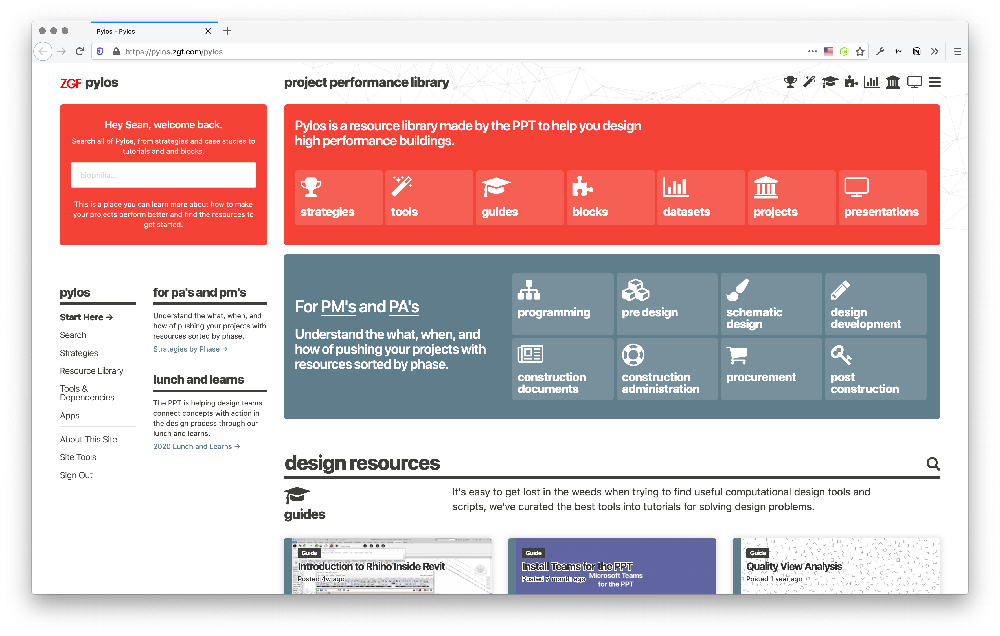

Pylos
==========================

Computational design resource repository and knowledge sharing platform for architecture firms.

Installation
--------------------------

Installing Pylos is not as easy as it should be but you can do so with some easy steps:

* Requires a LAMP stack with PHP 7.2+ and any SQL database supported by CodeIgniter 3.1 framework (only tested with mysqli)
* Grab the entire repo from seanwittmeyer/pylos and place the code at the top level directory publicly visible for your domain.
* Run Composer with the included composer.json file to populate php dependencies
* Rename the .env.example file as .env.development and update its content with relevant keys and passwords
* Initialize the database from the included mysql dump file (not included/prepared yet, talk to Sean for this)
* Sign in with the default user (admin:Password!)

Pylos integrates with Deltek Vision and Open Asset through Knowledge Architecture's Synthesis API (NEXUS), you will need to reach out to KA to get access to an API key to connect employees and project data.
We also connect to Github to integrate the ladybug.tools Hydrashare database of resources.
Other integrations will be listed here as they are developed.

Configuration
--------------------------

We don't store credentials in the code anymore so dive into the .env file to get Pylos running and connected to your resources. The integrations above all get set here. Any variables set in that file can also be set at the webserver level as environment variables. We use [vlucas/dotenv](https://github.com/vlucas/dotenv) to handle these variables to you can customize as they allow. 
More information will be added here as Pylos becomes more of a formal platform.

Usage
--------------------------

The way we have been using the platform started with adding any and all content we create and through complete and strategic tagging, we have made ways to access content through tags. More on this soon.

Security
--------------------------

If you discover a security vulnerability within this package, please send an email to Sean Wittmeyer at theseanwitt [at] gmail [dot] com. All security vulnerabilities will be promptly addressed.

License
--------------------------

Pylos is copyright Sean Wittmeyer is licensed under [The MIT License](LICENSE).
